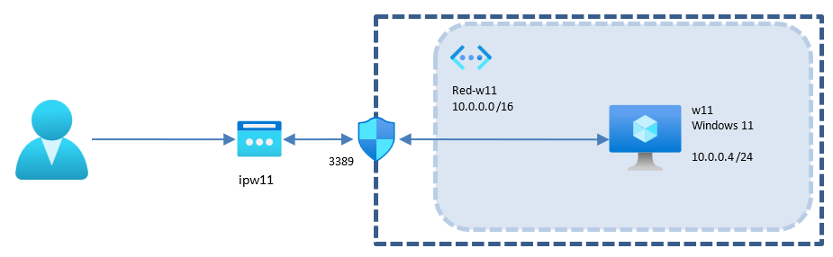

# Creación de una Máquina Virtual
{: .no_toc }

  

    Tabla de contenidos
  

  {: .text-delta }
- TOC
{:toc}

## Objetivo del Proyecto

En esta práctica vamos a crear en la nube una máquina virtual de Windows 11 y nos conectaremos a ella por RDP. Conoceremos los recursos de Azure asociados a la creación de esa máquina virtual:
- La propia máquina virtual.
- El disco duro de la máquina virtual.
- La tarjeta de red de la máquina virtual.
- La red virtual a la que está conectada la máquina.
- Una dirección IP pública para conectarnos desde el exterior.
- Un grupo de seguridad para controlar los accesos.

## Esquema en Azure

## Práctica a Realizar

1.  Empezamos creando un grupo de recursos con el nombre que queramos, por ejemplo *practica-1*.

{: .warning }
Es importante que todos los recursos que creemos a continuación estén en la misma Región que nuestro grupo de recursos. Si se nos cambia automáticamente al crear un recurso, deberemos cambiarlo de forma manual. Esto suele pasar al elegir la imagen durante el proceso de creación de una máquina virtual.  

___

{:style="counter-reset:none"}

2.  Creamos la máquina Windows 11:
- El tamaño de la máquina será el mínimo para poder correr Windows 11 (4GiB RAM).
- No será necesaria redundancia en las zonas de disponibilidad. 
- El nombre del equipo será *w11*.
- Por motivos de coste, el disco duro del sistema será de tipo HDD Estándar.
- En el apartado Redes nos propone crear una red nueva llamada *w11-vnet*  con un espacio de direcciones 10.0.0.0/16 y una subred llamada *default* 10.0.0.0/24. Aceptamos la propuesta por defecto.
- También nos propone crear una nueva IP Pública con nombre por defecto *w11-ip*. También aceptamos la propuesta por defecto.
- Hemos de asegurarnos al crear la máquina que habilitamos el puerto para RDP (3389). Eso nos creará un Grupo de Seguridad (nsg) con el puerto 3389 abierto desde todas las direcciones.  

___

{:style="counter-reset:none"}

3. Una vez finalizada la implementación, ve al grupo de recursos *practica-1* y comprueba todos los recursos creados. Si todo ha ido bien se nos han debido crear los siguientes 6 recursos en nuestro Grupo de Recursos *practica-1*: (compáralos con el esquema del enunciado)
- Una máquina virtual (*w11*).
- Una red virtual (*w11-vnet*).
- Un grupo de seguridad (*w11-nsg*).
- Una IP Pública (*W11-ip*).
- Un disco duro (*w11_disk1_XXXXXXXX*). (No aparece en el esquema del enunciado)
- Una tarjeta de red (*w11XXX*). (No aparece en el esquema del enunciado)

___

{:style="counter-reset:none"}

4.	Vamos a hacer una serie de comprobaciones para ver que todo está correcto. Viendo todos los recursos creados en *practica-1*:
- En primer lugar, pincha sobre la dirección IP Pública y anota la IP asignada a la máquina.
- En el grupo de seguridad, asegúrate que en la información esencial aparece como que hay asociada una interface de red (*w11XXX*) y que hay una regla de entrada para el puerto 3389 con cualquier origen.
- Aún en el grupo de seguridad, en el menú de la izquierda **Interfaces de red** comprueba la IP interna y externa asociada a cada tarjeta de red, así como a la máquina conectada.

___

{:style="counter-reset:none"}

5.	Con la máquina arrancada, conéctate a ella desde tu ordenador mediante conexión de escritorio remoto.

___

{:style="counter-reset:none"}

6.	Comprueba desde el sistema operativo la IP Privada automática que se le ha asignado a la máquina dentro de la red virtual.

___

{:style="counter-reset:none"}

7.	Apaga la máquina y **elimina el grupo de recursos creado en el primer punto para asegurarnos que no dejamos ningún recurso consumiendo crédito**.
