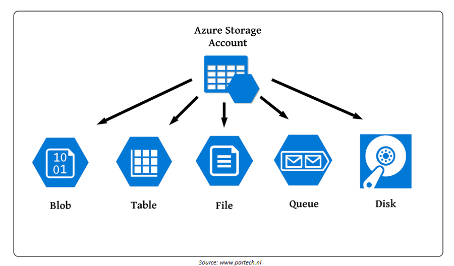
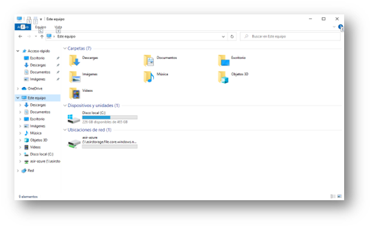

# Almacenamiento en Azure

## Objetivo del Proyecto

En esta práctica conoceremos una de las múltiples soluciones de almacenamiento que nos ofrece Azure, en concreto **Azure Files**. 

Azure ofrece muchas soluciones y servicios de almacenamiento. Las 5 principales soluciones relacionadas con el almacenamiento se agrupan bajo el nombre de **Azure Storage**, y comprende los siguientes servicios: 

- **Azure Blobs**: Almacén de objetos en la nube (como DropBox o OneDrive) y estos objetos son accesibles desde cualquier parte, incluso como direcciones url. 

- **Azure Files**: recursos compartidos de archivos totalmente administrados en la nube a los que se puede acceder mediante los protocolos SMB o NFS, desde clientes Windows, Linux o MacOS, tanto virtuales como locales. 

- **Colas de Azure**: un almacén para mensajería entre componentes de aplicación. 

- **Azure Disks**: volúmenes de almacenamiento en el nivel de bloque para máquinas virtuales de Azure, es decir discos virtuales para su uso en máquinas virtuales Azure. 

- **Tablas de Azure**: Opción tabla NoSQL para datos estructurados y no relacionales. 

Todos los servicios de almacenamiento necesitan estar asociados a una cuenta de almacenamiento (**Azure Storage Account**). Podemos tener una o varias de estas cuentas de almacenamiento en varios grupos de recursos.  

Nosotros en esta práctica vamos a centrarnos en el servicio **Azure Files**. Con este servicio vamos a poder crear en la nube un recurso de almacenamiento compartido al que accederemos desde nuestra máquina local mediante los protocolos SMB (si lo hacemos desde una máquina Windows) o NFS (desde un Linux). Haremos un punto de montaje persistente para tener siempre acceso a esa unidad de red. 

El funcionamiento será similar a si tuviéramos los datos almacenados en un NAS, pero en este caso accesible desde cualquier punto. 

## Práctica a Realizar

1.  Empezamos creando un grupo de recursos con el nombre que queramos, por ejemplo *almacenamiento*.

___

{:style="counter-reset:none"}

2. Creamos una **Cuenta de Almacenamiento** en el grupo de recursos almacenamiento que acabamos de crear:
- Nombra a la cuenta de almacenamiento como quieras, por ejemplo, *asirstorage*
- Por motivos de coste, selecciona la opción de Rendimiento Estándar y la Redundancia Local (LRS) 

___

{:style="counter-reset:none"}

3. Una vez creada la cuenta de almacenamiento, vamos a crear el recurso de **Azure Files** propiamente dicho. Para ello, accedemos a la Cuenta de Almacenamiento, y en el menú de opciones de la izquierda seleccionamos **Recursos Compartidos de Archivos**. 

___

{:style="counter-reset:none"}

4. Pulsamos sobre la opción **Nuevo Recurso Compartido de Archivos**: 
- Nombra el recurso como quieras, por ejemplo, *asir-azure*. 
- Selecciona un Nivel. 
- En la opción de Backup, **Deshabilita la copia de seguridad**. 

{: .note } 
Deshabilitar la copia de seguridad no es aconsejable, pero nos facilitará la eliminación del recurso cuando hayamos acabado con la práctica.

___

{:style="counter-reset:none"}

5. Accede al recurso recién creado *asir-azure*. Mediante la opción **Examinar**: 
- Agrega un directorio. 
- Carga un fichero en él. 

___

{:style="counter-reset:none"}

6. En la **Información General** del recurso hay una opción que pone **Conectar**. En ella nos aparecen scripts para Windows, Linux y Mac. Copia el script para el sistema operativo de la máquina que vayas a utilizar para probarlo (por ejemplo, un Windows). 

___

{:style="counter-reset:none"}

7. En una máquina externa crea un script con el contenido copiado. 
- Si es una máquina Windows el archivo debe acabar con la extensión *.ps1*, y si es Linux nómbralo con la extensión *.sh* 
- Para ejecutar el script en Windows antes tienes que habilitar previamente la ejecución de scripts como administrador `Set-ExecutionPolicy Unrestricted`
- Para ejecutar el script en Linux debes asignar permisos de ejcución (*a+x*). 

___

{:style="counter-reset:none"}

8. Es posible que tras la ejecución en Windows nos diga que ha funcionado correctamente, pero al visualizar las unidades mediante *Get-PSDrive* no nos aparezca la recién creada. Copia la línea del script y vuélvela a ejecutar (con tu usuario): 

    `New-PSDrive -Name Z -PSProvider FileSystem -Root "\\asirstorage.file.core.windows.net\asir-azure" -Persist`

___

{:style="counter-reset:none"}

9. Accede a Este Equipo y comprueba que tenemos la nueva Ubicación de Red. 

{: .warning } 
Cada vez que iniciemos la máquina, la conexión de red estará disponible. Para desconectarla pulsa con el botón derecho sobre la Unidad y selecciona *Desconectar*. 

___

{:style="counter-reset:none"}

11. **Elimina el grupo de recursos creado en el primer punto para asegurarnos que no dejamos ningún recurso consumiendo crédito.**