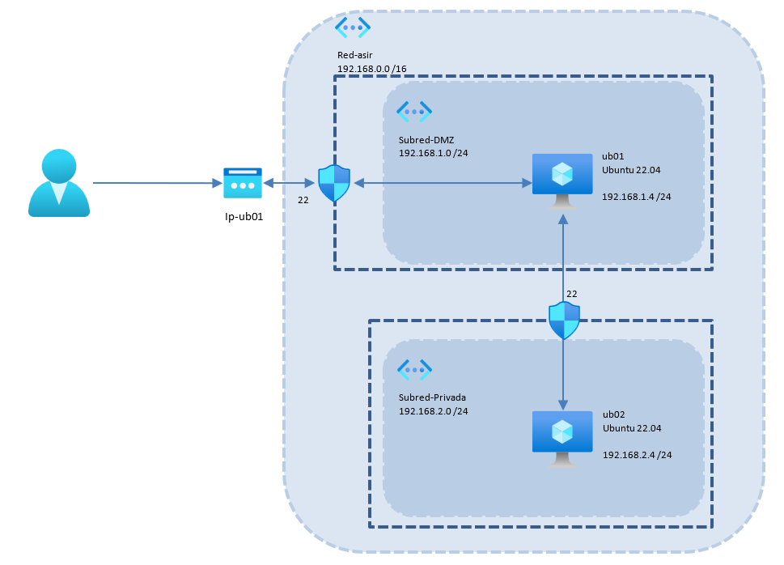
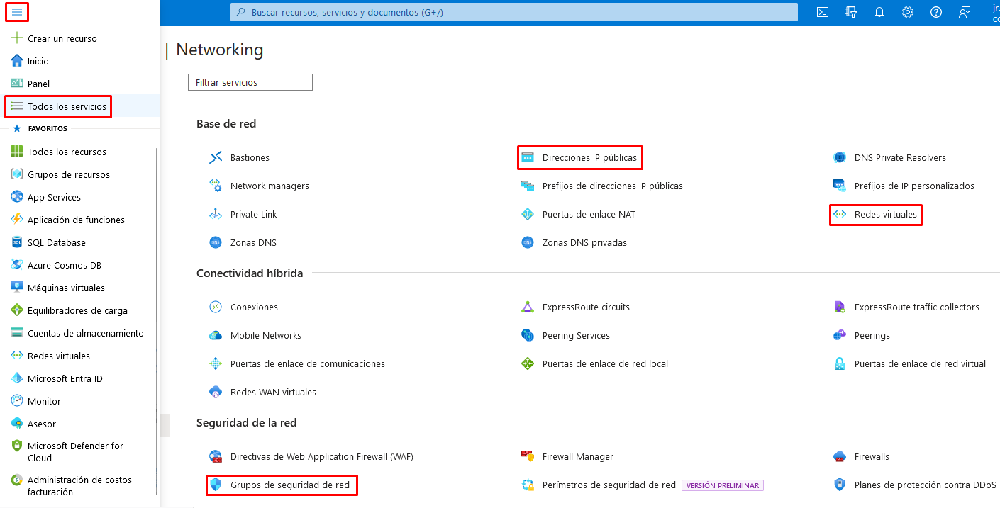
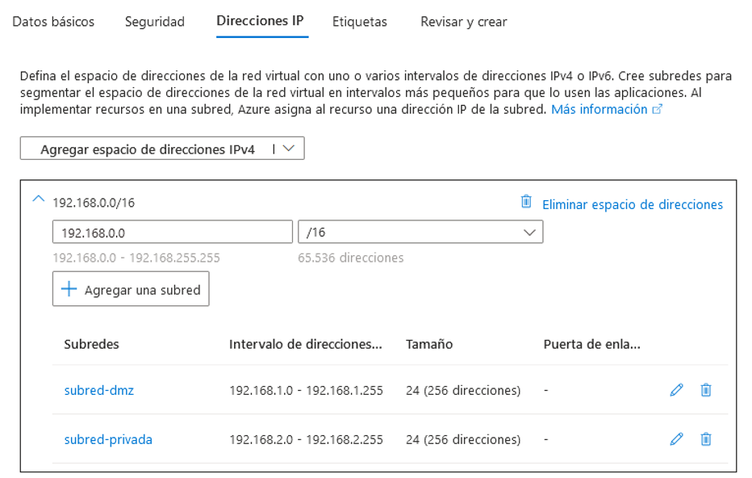
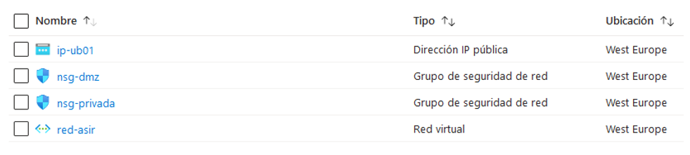

# Redes Virtuales
{: .no_toc }

  

    Tabla de contenidos
  

  {: .text-delta }
- TOC
{:toc}

## Objetivo del Proyecto

En la práctica de creación de la Máquina Virtual hemos visto que al crear una máquina en Azure se nos crean una serie de recursos asociados a la red en la que se encuentra la máquina:
- La tarjeta de red de la máquina virtual.
- La red virtual a la que está conectada esa tarjeta de red.
- Un grupo de seguridad que ejerce de cortafuegos.
- Una dirección IP pública para conectarnos desde el exterior.

En esta práctica vamos a crear de manera manual todos estos recursos para poder configurarlos según nuestras necesidades. Vamos a implementar un esquema en el que tendremos una red virtual con dos subredes (*subred-dmz* y *subred-privada*). En cada una de ellas crearemos una máquina virtual Ubuntu:
- La primera será accesible desde el exterior de la red (desde Internet) y para ello crearemos un grupo de seguridad en el que habilitaremos el puerto 22 (ssh) para que puedan entrar desde cualquier dirección.
- La segunda máquina estará en la subred-privada y configuraremos su grupo de seguridad para que sea accesible únicamente desde la *subred-dmz*, sin acceso desde el exterior.

## Esquema en Azure

## Práctica a Realizar

1.  Empezamos creando un grupo de recursos con el nombre que queramos, por ejemplo *practica-3*.

{: .warning }
Es importante que todos los recursos que creemos a continuación estén en la misma Región que nuestro grupo de recursos. Si se nos cambia automáticamente al crear un recurso, deberemos cambiarlo de forma manual. Esto puede pasar al elegir la imagen durante el proceso de creación de una máquina virtual.  

___

{: .warning }
Para crear los recuros de red vamos a hacerlo desde el menú **Todos los Servicios** (apartado Redes). Si no lo hacemos desde esta opción de menú nos irá a la creación del recurso clásico y no será compatible con nuestras máquinas.

___

{:style="counter-reset:none"}

2.	El primer paso será crear la red virtual que englobará toda la infraestructura. Accedemos al menú **Todos los Servicios** y en el apartado **Redes** seleccionamos **Redes Virtuales**:
- Le ponemos un nombre, por ejemplo, *red-asir*.
- En el espacio de direcciones le pondremos el rango de direcciones de la red. En nuestro caso 192.168.0.0/16
- En subredes eliminamos la que nos propone por defecto y añadimos 2 nuevas: 
  - Ponemos los datos de nuestra primera subred (*subred-dmz*, espacio de direcciones 192.168.1.0/24).
  - Y de la segunda (*subred-privada* y el espacio de direcciones 192.168.2.0/24). 
  - En este proceso podemos crear también los grupos de seguridad, pero lo dejamos para hacerlo desde fuera en el siguiente paso.

___

{:style="counter-reset:none"}

3.	Cuando hayamos finalizado la creación de la Red Virttual, vamos a crear los 2 **grupos de seguridad** para establecer los permisos en las conexiones hacia y desde las subredes. Lo podríamos haber hecho durante el proceso de creación de las subredes. Comenzamos con el primer grupo de seguridad que permitirá la conexión desde Internet hacia las máquinas que se encuentren en la *subred-dmz*. Creamos un recurso llamado **Grupo de Seguridad de Red** (se encuentra en el apartado **Redes**) y le llamamos *nsg-dmz*

___

{:style="counter-reset:none"}

4.	Una vez creado, accedemos al recurso y en el apartado **Reglas de Entrada** añadimos una nueva regla para permitir conexiones SSH desde el exterior:
- Origen en cualquier dirección y permitirá la conexión por el puerto 22 (*servicio SSH*)

___

{:style="counter-reset:none"}

5.	Creamos un nuevo **Grupo de Seguridad de Red** y le llamamos *nsg-privada*. Una vez creado, accedemos al recurso y en el apartado **Reglas de Entrada** visualizamos las reglas predeterminadas. Comprobamos que hay una (*AllowVnetInbound*) que admite cualquier conexión desde las redes virtuales de Azure. Puesto que esa es la única que necesitamos, ya no añadimos más reglas.

___

{:style="counter-reset:none"}

6.	Ya tenemos la red virtual con las 2 subredes y los grupos de seguridad. Vamos a crear un recurso de **IP Pública** que nos servirá para conectarnos a una de las máquinas virtuales desde el exterior. Creamos un recurso y desde el apartado **Redes** añadimos una **Dirección IP Pública** a nuestro grupo de recursos con los valores por defecto. Le asignamos un nombre, por ejemplo, *ip-ub01*, puesto que irá asociada a una máquina que llamaremos igual, para que nos sea más sencillo identificarla.

___

{:style="counter-reset:none"}

7.	Una vez creada toda nuestra infraestructura de red, nos queda crear las máquinas virtuales y colocarlas en cada subred, y asociarlas a los grupos de seguridad creados, así como asignar la IP Pública a la máquina que corresponda.

___

{:style="counter-reset:none"}

8.	Comenzamos creando la máquina *Ubuntu 01*:
- El tamaño de la máquina será el mínimo para poder correr Ubuntu Server 22.04 (2GiB RAM serán suficientes para la prueba).
- No será necesaria redundancia en las zonas de disponibilidad. 
- El nombre del equipo será *ub01*.
- El tipo de **autenticación será por Clave Pública SSH**. (Será necesaria la descarga de la clave privada al finalizar la creación).
- Dejamos habilitado el puerto 22 para poder conectarnos a la máquina.
- Por motivos de coste, el disco duro del sistema será de tipo HDD Estándar.
- En el apartado Redes seleccionamos la red creada anteriormente, y la subred *subred-dmz*.
- También seleccionamos la IP Pública creada antes *ip-ub01*.
- En el grupo de seguridad seleccionamos Ninguno. Lo asociaremos a continuación.

___

{:style="counter-reset:none"}

9.	Una vez finalizada la implementación, ve al grupo de recursos y **en la interfaz de red** de la máquina recién creada, en el apartado **Grupo de Seguridad de Red**, asóciala al grupo *nsg-dmz*.

___

{:style="counter-reset:none"}

10.	Vamos ahora con la segunda máquina. Repite los pasos que con la máquina *Ubuntu 1* pero teniendo en cuenta lo siguiente:
- El nombre del equipo será *ub02*.
- El **tipo de autenticación será por contraseña**.
- Dejamos habilitado el puerto 22 para poder conectarnos a la máquina.
- Por motivos de coste, el disco duro del sistema será de tipo HDD Estándar.
- En el apartado Redes seleccionamos la red creada anteriormente, y la subred *subred-privada*. 
- **No tendrá IP Pública**.
- En el grupo de seguridad seleccionamos Avanzado y asóciale el grupo de seguridad *nsg-privada*.

___

{:style="counter-reset:none"}

11.	Una vez finalizada la implementación, ve al grupo de recursos y comprueba todos los recursos creados. Si todo ha ido bien se nos han debido crear los siguientes 11 recursos en nuestro Grupo de Recursos practica-3: (**compáralos con el esquema del enunciado**)
- Dos máquinas virtuales (*ub01* y *ub02*).
- Una red virtual (*red-asir*).
- Dos grupos de seguridad (*nsg-dmz* y *nsg-privada*).
- Una IP Pública (*ip-ub01*).
- Dos discos duros (Uno por cada máquina). (No aparece en el esquema del enunciado)
- Dos tarjetas de red (una por cada máquina). (No aparece en el esquema del enunciado)
- Una clave SSH (para conectarnos a la máquina *ub01*).

___

{:style="counter-reset:none"}

12.	Con las máquinas arrancadas, conéctate a *ub01* desde tu ordenador mediante `ssh` indicándole la IP Pública y con el parámetro `-i` la ubicación de la clave privada descargada.

{: .warning }
Al conectarnos con la clave privada descargada nos dará error de fichero inseguro. Para poder conectarnos sin problemas debemos establecer restricciones en los permisos (tanto en Windows como en Linux), dejando control total únicamente a nuestro usuario.

___

{:style="counter-reset:none"}

13.	Comprueba en *ub01*, mediante el comando `ip a`, que la dirección IP privada de la tarjeta de red de la máquina está dentro del rango de direcciones de la subred *subred-dmz*.

___

{:style="counter-reset:none"}

14.	Desde el portal de Azure, sitúate en la tarjeta de red de la máquina *ub02* y comprueba qué dirección IP se le ha asignado (debe estar dentro del rango de direcciones de la *subred-privada*).

___

{:style="counter-reset:none"}

15.	Desde la máquina *ub01* conéctate mediante ssh a la máquina *ub02*, utilizando la dirección IP asignada. Al hacer la conexión desde la misma red de virtual, podemos conectarnos sin problemas según la configuración de seguridad que hemos hecho en *nsg-privada*.

___

{:style="counter-reset:none"}

16.	Crea ahora en el grupo de recursos *práctica-3* una **nueva dirección IP Pública** llamada *ip-ub02* y asígnala a la interfaz de red de la máquina *ub02*.

___

{:style="counter-reset:none"}

17.	Desde tu equipo, haz un ssh a la nueva dirección pública para poder conectarnos a *ub02* sin pasar por *ub01*. No debes poder establecer la conexión.

{: .note }
Fíjate que según las reglas de seguridad que hemos establecido, a la máquina *ub02* se puede acceder sin problemas desde la máquina *ub01*, pero no desde el exterior.

___

{:style="counter-reset:none"}

18.	Añade una regla de entrada en el grupo de seguridad *nsg-privada* para permitir la conexión por ssh desde Internet, y comprueba que ya puedes conectarte desde tu equipo (deja pasar unos minutos antes de probarlo).

___

{:style="counter-reset:none"}

19.	Apaga las máquinas y **elimina el grupo de recursos creado en el primer punto para asegurarnos que no dejamos ningún recurso consumiendo crédito**.
