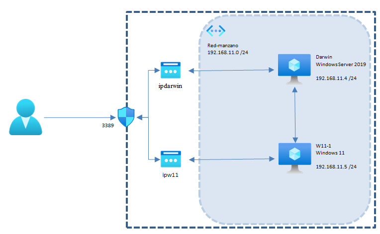

# Dominio con Cliente y Servidor en Azure
{: .no_toc }

  

    Tabla de contenidos
  

  {: .text-delta }
- TOC
{:toc}

## Objetivo del Proyecto

En esta práctica vamos a replicar en la nube el modelo de dominio de las prácticas de Windows Server que tenemos montado en VirtualBox, con un controlador de dominio en un sistema operativo Windows Server 2019 y un cliente Windows 11 conectado a ese dominio.

En este caso, tanto el servidor Windows Server 2019 como el cliente Windows 11 estarán hospedados en la nube, conectados en la misma red virtual.

## Esquema en Azure

## Práctica a Realizar

1.  Empezamos creando un grupo de recursos con el nombre que queramos, por ejemplo *manzano-azure*.

{: .warning }
Es importante que todos los recursos que creemos a continuación estén en la misma Región que nuestro grupo de recursos. Si se nos cambia automáticamente al crear un recurso, deberemos cambiarlo de forma manual. Esto puede pasar al elegir la imagen durante el proceso de creación de una máquina virtual.  

___

{:style="counter-reset:none"}

2.	Creamos la máquina **Windows Server 2019**:
- El tamaño de la máquina será el mínimo para poder correr Windows Server 2019 (4GiB RAM).
- No será necesaria redundancia en las zonas de disponibilidad. 
- El nombre del equipo será *Darwin*.
- Por motivos de coste, el disco duro del sistema será de tipo HDD Estándar.
- En la máquina Darwin has de añadir un disco de datos adicional de 1TB (HDD Stándard).
- En el apartado Redes crea una red virtual nueva llamada *red-manzano* con un espacio de direcciones 192.168.0.0/16 y una subred llamada *default* 192.168.11.0/24. En esta red conectaremos también la otra máquina virtual que creemos a continuación, ambas con una IP dentro de ese rango de direcciones.
- Crea una nueva IP Pública, con nombre *Darwin-IP* (el que aparece por defecto).
- Hemos de asegurarnos al crear la máquina que habilitamos el puerto para RDP (3389). Eso nos creará un **Grupo de Seguridad** (nsg) con el puerto 3389 abierto desde todas las direcciones. En **Grupo de Seguridad** selecciona **Opciones Avanzadas** para poder crear un nuevo NSG cuyo nombre será *nsg-manzano*. Este grupo de seguridad será también el que utilicemos en la otra máquina virtual. Solamente tiene una regla de entrada en la que se permite cualquier conexión por el puerto 3389.

___

{:style="counter-reset:none"}

3.	Creamos la máquina **W11**:
- El tamaño de la máquina debe ser el más económico que pueda soportar Windows 11.
- El nombre del equipo será *W11*.
- Asegúrate que el disco de sistema es tipo HDD estándar.
- Conecta la máquina a la subred *default* de *red-manzano* creada anteriormente.
- Crea una nueva IP Pública llamada *W11-ip*. 
- Habilita también la conexión mediante el puerto 3389. En las opciones del **Grupo de Seguridad** selecciona las **opciones avanzadas** y elige el grupo de seguridad creado anteriormente (*nsg-manzano*).

___

{:style="counter-reset:none"}

4.	Si todo ha ido bien se nos han debido crear los siguientes **11 recursos** en nuestro Grupo de Recursos *manzano-azure*:
- Una red virtual (*red-manzano*).
- Dos IP Públicas (*Darwin-ip* y *W11-ip*).
- Dos máquinas virtuales (*Darwin* y *w11*).
- Tres discos duros (uno de sistema por cada máquina y uno adicional en *Darwin*).
- Un grupo de seguridad (*nsg-manzano*).
- Dos tarjetas de red (una por cada máquina).

___

{:style="counter-reset:none"}

5.	Vamos a hacer una serie de comprobaciones para ver que todo está correcto. Viendo todos los recursos creados en manzano-azure:
- En primer lugar, pincha sobre las direcciones IP Públicas y anota las IP asignada a cada máquina.
- En el grupo de seguridad, asegúrate que en la información esencial aparece como que hay asociadas 2 interfaces de red (una por cada máquina) y que hay una regla de entrada para el puerto 3389 con cualquier origen.
- Aún en el grupo de seguridad, en el menú de la izquierda Interfaces de red comprueba la IP interna y externa asociada a cada tarjeta de red, así como a la máquina conectada.

___

{:style="counter-reset:none"}

6.	Con ambas máquinas arrancadas, conéctate a ellas mediante conexión de escritorio remoto desde tu máquina host.

___

{:style="counter-reset:none"}

7.	En ambas máquinas virtuales comprueba que las IP internas coinciden con las IP privadas que has anotado antes. Se les ha debido asignar por DHCP automáticamente una dirección dentro del rango de direcciones de la subred *default*.

___

{:style="counter-reset:none"}

8.	En la máquina Windows Server instala Active Directory y crea un dominio llamado *manzano.asir*

___

{:style="counter-reset:none"}

9.	Entra en el administrador de discos e inicializa el disco añadido con una tabla de particiones GPT. Crea un volumen simple (F:) y lo formateas con el sistema de fichero ReFS.

___

{:style="counter-reset:none"}

10.	Crea dos usuarios de dominio.

___

{:style="counter-reset:none"}

11.	Conecta la máquina *W11* al dominio. Deberás configurar la dirección del servidor DNS para poner la IP interna del equipo *Darwin*.

___

{:style="counter-reset:none"}

12.	Al reiniciar el equipo y conectarte por RDP, deberás poner las credenciales de del usuario creado en el dominio (*manzano\usuario*).

___

{:style="counter-reset:none"}

19.	Si no vas a realizar la siguiente práctica, apaga las máquinas y **elimina el grupo de recursos creado en el primer punto para asegurarnos que no dejamos ningún recurso consumiendo crédito**.
