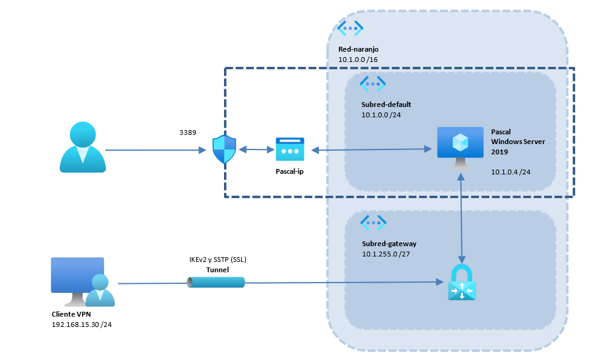

# Dominio con Cliente Local y Servidor en Azure
{: .no_toc }

  

    Tabla de contenidos
  

  {: .text-delta }
- TOC
{:toc}

## Objetivo del Proyecto

En esta práctica vamos a crear en la nube un controlador de dominio en un sistema operativo Windows Server 2019, crearemos un dominio y le conectaremos un cliente Windows local mediante una conexión VPN.

En este caso emularemos una solución híbrida, en la cual solo el servidor Windows Server 2019 estará hospedado en la nube, y el equipo cliente será una máquina local (en nuestro caso una máquina virtual de VirtualBox).

## Esquema en Azure

## Práctica a Realizar

{: .warning }
**Antes de empezar**: He tenido problemas al generar la *VPN Gateway* en la Región *West Europe*. Aconsejo seleccionar como región para crear el grupo de recursos la situada en **East US**.

1.  Empezamos creando un grupo de recursos con el nombre que queramos, por ejemplo *naranjo-azure*.

___

{:style="counter-reset:none"}

2.	Creamos la máquina **Windows Server 2019**:
- El tamaño de la máquina será el mínimo para poder correr Windows Server 2019 (4GiB RAM).
- No será necesaria redundancia en las zonas de disponibilidad. 
- El nombre del equipo será *Pascal*.
- Por motivos de coste, el disco duro del sistema será de tipo HDD Estándar.
- En el apartado Redes crea una red virtual nueva llamada *red-naranjo* con un espacio de direcciones 10.1.0.0/16 y una subred llamada *default* 10.1.0.0/24.
- Crea una nueva **IP Pública**, con nombre *Pascal-IP* (el que aparece por defecto).
- Hemos de asegurarnos al crear la máquina que habilitamos el puerto para RDP (3389). Eso nos creará un **Grupo de Seguridad** (nsg) con el puerto 3389 abierto desde todas las direcciones.

___

{:style="counter-reset:none"}

3.	Si todo ha ido bien se nos han debido crear los siguientes **6 recursos** en nuestro Grupo de Recursos *naranjo-azure*:
- Una red virtual (*red-naranjo*).
- Una IP Pública (*Pascal-ip*).
- Una máquina virtual (*Pascal*).
- Un disco duro (el disco de sistema de *Pascal*).
- Un grupo de seguridad (*Pascal-nsg*).
- Una tarjeta de red (la de la máquina *Pascal*).

___

{:style="counter-reset:none"}

4.	Conéctate a la máquina Pascal mediante conexión de escritorio remoto desde tu máquina host.

___

{:style="counter-reset:none"}

5.	Comprueba que la IP interna de la máquina está en el rango de nuestra subred *default* (seguramente la 10.1.0.4)

___

{:style="counter-reset:none"}

6.	Instala Active Directory y crea un dominio llamado *naranjo.asir*

___

{:style="counter-reset:none"}

7.	Sabemos que al instalar Active Directory en el servidor *Pascal*, se ha instalado también el servidor DNS en ese equipo. Vamos a configurar la red virtual *red-naranjo* para indicarle que el servidor DNS de nuestra red es la máquina *Pascal*. Esto nos hará falta para la configiración de red del cliente:
- Para ello accede al recurso correspondiente a la red *red-naranjo* y en la lista de opciones de la izquierda selecciona **Servidores DNS**.
- Selecciona la opción **Personalizado**
- Añade la dirección IP local de *Pascal* (10.1.0.4) y el servidor DNS de Google (8.8.8.8)

___

{:style="counter-reset:none"}

8.	Mientras se instala el dominio, en el portal de Azure vamos a crear la VPN para conectarnos. Para ello añade un recurso del tipo **Puerta de enlace de red virtual** (*VPN Gateway*) con las siguientes características:
- Ponle el nombre que quieras, por ejemplo *vpn-naranjo*
- Selecciona la **Región de Azure** donde tengas los demás recursos.
- En **Tipo de puerta de enlace** selecciona *VPN*
- En **SKU** y **Generación** seleccionamos respectivamente *VpnGw1* y *Generation 1* que nos entran en la capa gratuita de Azure.
- En la **Red virtual** selecciona la *red-naranjo*.
- En el **Intervalo de direcciones** ponemos la siguiente: *10.1.255.0/27* (Este Intervalo abarca únicamente 32 direcciones, desde la 10.1.255.0 hasta la 10.1.255.31 y se utiliza para direccionar elementos necesarios como la propia Puerta de Enlace y Túneles VPN. Recuerda que la máquina Windows Server está en otra subred, la *10.1.0.0/24*).
- Asigna una nueva **IP Pública** con el nombre que quieras, por ejemplo *VPN-ip*
- Marcamos como *Deshabilitado* la opción **Habilitar el modo Activo**

{: .warning }
El proceso de creación de la VPN puede tardar bastantes minutos. Ve configurando en VirtualBox la máquina cliente que se va a conectar al dominio.

___

{:style="counter-reset:none"}

9.	En la máquina Windows cliente que conectaremos al dominio vamos a crear dos certificados:
- **Un certificado raíz**: será el que subamos a Azure para validar las conexiones desde los clientes.
- **Un certificado cliente**: será generado a partir del certificado raíz y será necesario en el equipo cliente para validar la conexión.

Para la creación del cerificado raíz, inicia una sesión en PowerShell con provilegios de Administrador y ejecuta el siguiente comando:

`$cert = New-SelfSignedCertificate -Type 'Custom' -Subject 'CN=P2SRootCert' -KeySpec 'Signature' -KeyExportPolicy 'Exportable' -KeyUsage 'CertSign' -KeyUsageProperty 'Sign' -KeyLength 2048 -HashAlgorithm 'sha256' -NotAfter (Get-Date).AddMonths(24) -CertStoreLocation 'Cert:\CurrentUser\My'`

Para la creación del certificado cliente, sin cerrar la sesión de PowerShell, teclea:

`New-SelfSignedCertificate -Type 'Custom' -Subject 'CN=P2SChildCert' -DnsName 'P2SChildCert' -KeySpec 'Signature' -KeyExportPolicy 'Exportable' -KeyLength 2048 -HashAlgorithm 'sha256' -NotAfter (Get-Date).AddMonths(18) -CertStoreLocation 'Cert:\CurrentUser\My' -Signer $cert -TextExtension @('2.5.29.37={text}1.3.6.1.5.5.7.3.2')`

{: .important }
Comprueba que se han creado los 2 certificados accediendo a la **Consola de Gestión de Certificados**. Para ello pulsa las teclas *Windows +R* y ejecuta el comando `certmgr.msc`. En el contenedor de *Certificdos del Usuario Actual--> Personal --> Certificados* deben aparecer los 2 certificados que acabamos de crear: *P2SRootCert* y *P2SChildCert*

___

{:style="counter-reset:none"}

10.	Necesitamos subir a Azure el certificado raíz que acabamos de crear. Para ello es necesario exportar el certificado.
- En la **Consola de Gestión de Certificados** que acabas de abrir, sitúate sobre el certificado raíz (*P2SRootCert*) y con el botón derecho pulsa sobre **Todas las Acciones --> Exportar**
- En el asistente selecciona la opción de **No exportar Clave Privada**
- Selecciona el formato **X.509 codificado base 64 (.CER)**
- Selecciona una ubicación (por ejemplo el Escritorio) y un nombre de archivo.
- Ve a la ubicación del archivo que acabas de exportar y ábrelo con el Bloc de Notas.
- Copia al portapapeles (si estás en VirtualBox asegúrate de tener habilitada la opción y haber instalado las Guest Additions) las líneas que hay entre medio de -----BEGIN CERTIFICATE----- y -----END CERTIFICATE-----

___

{:style="counter-reset:none"}

11.	Una vez se haya acabado de implementar la **Puerta de enlace de red virtual** hay que configurar el acceso. Para ello entra en el recurso y en la lista de opciones que aparece a la izquierda selecciona **Configuración de punto a sitio**
- En **Grupo de direcciones** selecciona el rango 192.168.15.0/24. Este será el rango en el que la VPN asignará una dirección IP a la máquina cliente.
- En **Tipo de Túnel** selecciona *IKEv2 y SSTP (SSL)*. Son los necesarios para un cliente Windows.
- En **Tipo de Autentificación** selecciona *Certificado de Azure*
- En los **Certificados raíz** pon un nombre que quieras (por ejemplo *cert_root*) y en los datos del certificado público pega la clave pública que habías copiado al portapapeles en el paso anterior.
- Por último, pulsa en **Guardar**

{: .note }
El proceso de Guardar le puede costar unos minutos

___

{:style="counter-reset:none"}

12.	Una vez finalizado el proceso de guardar hay que pulsar sobre la opción **Descargar el cliente VPN**. Este fichero lo debemos copiar a la máquina cliente Windows 10 que vamos a conectar al dominio y nos servirá para configurar de manera automática la VPN en el cliente. Podríamos hacerlo sin este asistente, pero habría que configurar todos los datos de manera manual.

___

{:style="counter-reset:none"}

13.	En la máquina cliente Windows 10 extraemos el fichero zip descargado, y en la carpeta **WindowsAmd64** ejecutamos el fichero *VpnClientSetupAmd64.exe*

___

{:style="counter-reset:none"}

14.	Se ha debido crear la conexión VPN. Accedemos al menú **Configuración** de Windows, y en la opción **Redes e Internet** pulsamos sobre **VPN**. Nos debe aparecer la recién creada, y pulsamos sobre **Conectar.**

{: .note }
Podemos comprobar que todo ha ido bien abriendo una consola de powershell y ejecutando el comando `ipconfig /all` y si todo ha funcionado nos debe mostar un nuevo adaptador de red con una IP dentro del rango *192.168.15.0/24* y con el DNS *10.1.0.4*. También podemos ejecutar `ping pascal.naranjo.asir` y el servidor nos debe contestar.

___

{:style="counter-reset:none"}

15.	Ya estamos en condiciones de unir el equipo al dominio. Simplemente ve a las propiedades del Equipo y cambia el grupo de trabajo por el dominio *naranjo.asir*. No hace falta configurar la red (introducir la IP del servidor DNS) pues ya se ha hecho automáticamente con la creación de la VPN.

___

{:style="counter-reset:none"}

16.	Accede al servidor y en la consola **Usuario y equipos de Active Directory** comprueba que en *computers* aparece como miembro del dominio el equipo que acabamos de unir.

{: .important }
El siguiente paso natural sería iniciar sesión en el cliente con un usuario del dominio. No lo vamos a hacer, la práctica termina aquí, pues para poder iniciar sesión en el dominio hay que conectar cada vez la VPN, y es un proceso más largo.

___

{:style="counter-reset:none"}

19.	Apaga las máquinas y **elimina el grupo de recursos creado en el primer punto para asegurarnos que no dejamos ningún recurso consumiendo crédito**.
