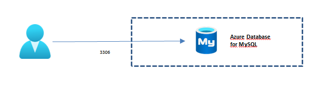
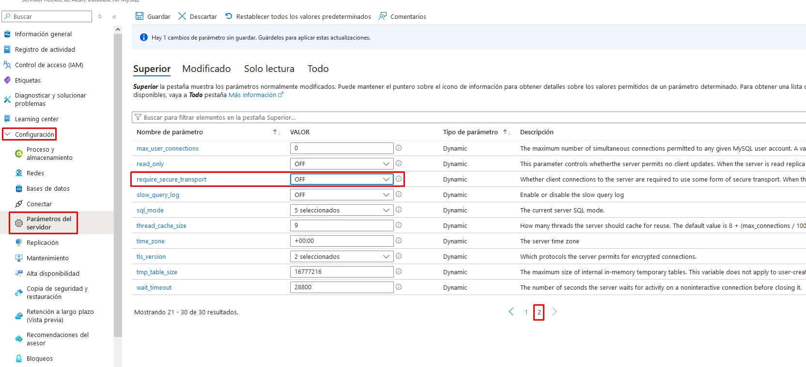
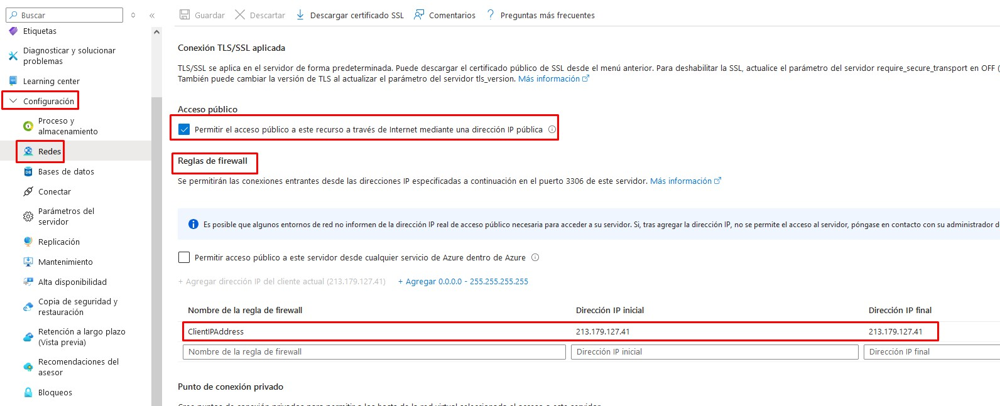

# Bases de Datos Gestionadas
{: .no_toc }

  

    Tabla de contenidos
  

  {: .text-delta }
- TOC
{:toc}

## Objetivo del Proyecto

Para trabajar con una BBDD en Azure podemos optar por 2 modelos diferenciados según sean *IaaS* o *PaaS*:
- En el primer caso, en un modelo de **Infraestructura como Servicio**, contrataríamos la máquina virtual, en una red virtual e instalaríamos el SGBD que consideráramos oportuno (MySQL, SQL Server, PostgrsSQL, …). En este modelo gestionaríamos nosotros toda la infraestructura.
- En el caso de optar por un modelo de **Plataforma como Servicio**, contrataríamos directamente el servicio de base de datos, sin preocuparnos por gestionar la infraestructura que hay por debajo (máquina, red, sistema operativo y sistema gestor de base de datos). Es lo que se conoce como un servicio gestionado. Las bases de datos gestionadas son servicios de base de datos en la nube en los que el proveedor se encarga de toda la administración y mantenimiento, desde la instalación y configuración inicial hasta la escalabilidad, seguridad, copias de seguridad y actualizaciones.

Azure ofrece varios servicios gestionados de Bases de Datos. Los más populares son:
- **Azure SQL Database**: Es una base de datos relacional gestionada basada en Microsoft SQL Server.
- **Azure Database for MySQL**: En este caso el SGBD es MySQL.
- **Azure Database for PostrgeSQL**: Similar a los anteriores pero con PostgreSQL.
- **Azure Database for MariaDB**: Con el SGBD MariaDB
- **CosmosDB**: En este caso se trata de una base de datos NoSQL que soporta varios modelos de datos (clave-valor, documentos, grafos y columnas anchas).

{: .note }
En esta práctica, el servicio gestionado de BBDD que vamos a utilizar es **Azure Database for MySQL**, que permite ejecutar bases de datos MySQL. 

## Esquema en Azure

## Práctica a Realizar

1.  Empezamos creando un grupo de recursos con el nombre que queramos, por ejemplo *practica-bbdd*.

___

{:style="counter-reset:none"}

2.	Creamos un recurso, dentro de la categoría Bases de datos, del tipo **Azure Database for MySQL**:
-	Seleccionamos el tipo de servicio *Servidor Flexible* y optamos por la creación rápida (Quick Create).
-	Lo ubicamos en el grupo de recursos creado anteriormente.
-	Ponemos un nombre de servidor que debe ser único en Azure. Introduce uno que lleve tu nombre o iniciales.
-	Asignamos nombre de usuario administrador y su contraseña.
- El tipo de carga de trabajo será para desarrollo y pruebas (*Dev/Test*). Esto repercute en el tamaño de la máquina subyacente y por consiguiente en el precio.
-	Importante: Agregamos una regla de firewall para la dirección IP desde la que estamos conectados. Esto nos permitirá establecer conexiones remotas desde nuestro equipo local a la BBDD, imposibilitando la conexión desde otras IPs externas que no sean la nuestra. Podemos hacerlo también una vez creado el recurso.
-	Los demás campos los dejamos por defecto.

___

{:style="counter-reset:none"}

3.	Una vez creado el recurso accedemos a él y vamos a cambiar un parámetro relacionado con la seguridad para facilitar la conexión remota sin necesidad de certificados SSL. Accedemos a la configuración, al apartado *Parámetros del Servidor*. Ponemos a **OFF** el parámetro *require_secure_transport*. Guardamos.

___

{:style="counter-reset:none"}

4.	En las reglas del firewall nos aseguramos de que se ha creado la regla que definimos en el momento de la creación para permitir conexiones desde nuestra IP.

___

{:style="counter-reset:none"}

5.	En el apartado *Información general* encontramos el nombre del servidor completo que será el que pongamos en la cadena de conexión. También lo encontramos desde el apartado *Conectar*, junto con el resto de los datos necesarios para la cadena de conexión.

___

{:style="counter-reset:none"}

6.	También en el apartado de *Información General* nos aparecen los datos de la configuración de la máquina virtual sobre la que está corriendo nuestro SGBD, así como la versión de MySQL instalada.

___

{:style="counter-reset:none"}

7.	Si deseáramos escalar verticalmente nuestro servicio, podríamos hacerlo desde el aparatado de configuración *Proceso y Almacenamiento*.

___

{:style="counter-reset:none"}

8.	En nuestra máquina local establacemos una conexión mediante un cliente de MySQL de línea de comandos, indicando la cadena de conexión y el usuario que hemos definido como administrador. En el parámetro host `-h` ponemos el nombre del servidor y en el parámetro de usuario `-u` el nombre del usuario. Para que nos solicite el password indicamos el parámetro `-p`.

`mysql -h jrpm-bbdd.mysql.database.azure.com -u administrador -p`

{: .warning }
Si no hubiéramos configurado el servidor de BBDD con la opción *require_secure_transport* a *OFF* deberíamos descargar un certificado SSL público e indicarle en la línea de comandos la ubicación de dicho certificado. Se puede descargar desde el apartado de *Configuración --> Redes* o directamente desde el enlace de descarga del [certificado SSL público](https://dl.cacerts.digicert.com/DigiCertGlobalRootCA.crt.pem)

___

{:style="counter-reset:none"}

9.	Podemos establacer conexión remota también mediante clientes GUI como *DBeaver*, *HeidiSQL*, *MySQL Workbench*, ... Debemos tener la precaución al configurar la conexión en estos clientes de indicar también la ubicación del archivo descargado con el certificado SSL, en caso de tener en el servidor marcada la opción de *require_secure_transport* a *ON*.

___

{:style="counter-reset:none"}

10.	Detén el servidor de BBDD y **elimina el grupo de recursos creado en el primer punto para asegurarnos que no dejamos ningún recurso consumiendo crédito**.

{: .important }
Si detenemos un servidor de BBDD, Azure lo iniciará automáticamente a los 30 días (si no lo hemos levantado nosotros de manera manual antes). Esto es peligroso, pues si olvidamos eliminar un recurso de BBDD que no utilizamos, se pondrá en marcha automáticamente a los 30 días de haberlo detenido, con el consiguiente consumo de crédito.

